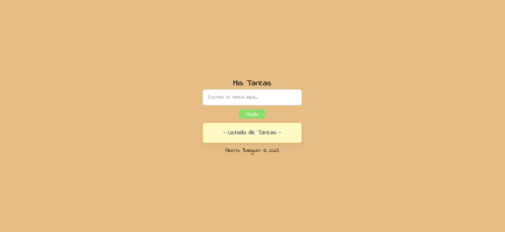
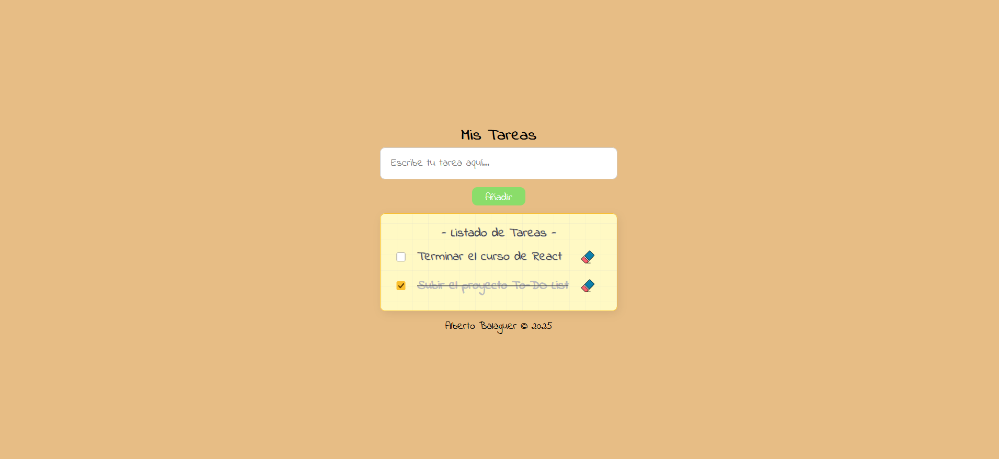

# 📝 To-Do List

Aplicación web de lista de tareas que permite gestionar de forma sencilla tus pendientes. Para practicar lógica con JavaScript y manipulación del DOM.
Permite añadir, marcar como completadas y eliminar tareas. Los datos se almacenan de forma persistente en el navegador mediante **LocalStorage** por lo tanto la lista se conserva aunque cierres la página

## 🚀 Demo

🔗 [Ver demo online](https://albertob86.github.io/to-do-list/)

## 🛠 Tecnologías utilizadas

- HTML5
- CSS3
- JavaScript
- LocalStorage

## 📸 Captura
### Vista principal
 

### Tareas añadidas



## 🎯 Funcionalidades

- ✅ Añadir nuevas tareas a la lista
- ✏️ Marcar tareas como completadas
- ❌ Eliminar tareas de la lista
- 💾 **Persistencia de datos** con LocalStorage para que la información se mantenga al recargar la página

## 📂 Cómo usar

1. Clona el repositorio:
   ```bash
   git clone https://github.com/AlbertoB86/to-do-list.git
   
2. Abre el archivo index.html en tu navegador
